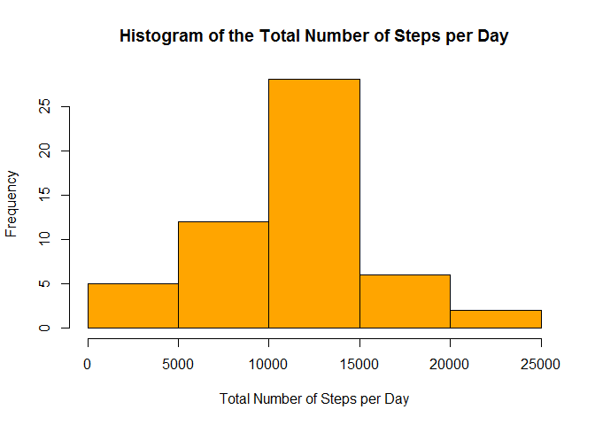

# Reproducible Research: Peer Assessment 1

## Loading and preprocessing the data

### Reading the Data
The following code is responsible for reading the Steps Data from the  activity.csv file, compressed into the file activity.zip, which is located at the cloned repository.

The data read is stored in the data frame *stepsdata* 


```r
currdir <- getwd()
setwd("C://Users//Paulo//Coursera//ReproducibleResearch//Assignment1//RepData_PeerAssessment1")
stepsdata <- read.csv(unzip("activity.zip","activity.csv"))
setwd(currdir)
```

### Processing the Data
The data read has the following structure. 


```r
str(stepsdata)
```

```
## 'data.frame':	17568 obs. of  3 variables:
##  $ steps   : int  NA NA NA NA NA NA NA NA NA NA ...
##  $ date    : Factor w/ 61 levels "2012-10-01","2012-10-02",..: 1 1 1 1 1 1 1 1 1 1 ...
##  $ interval: int  0 5 10 15 20 25 30 35 40 45 ...
```

Note that the variable *date* is of factor class. In order to convert it to Date class, it is used the following code:


```r
stepsdata$date <- as.Date(stepsdata$date, "%Y-%m-%d")
```

Now, the variable *date* is of date class, as it can be seen in the new structure os the *stepsdata* data frame.


```r
str(stepsdata)
```

```
## 'data.frame':	17568 obs. of  3 variables:
##  $ steps   : int  NA NA NA NA NA NA NA NA NA NA ...
##  $ date    : Date, format: "2012-10-01" "2012-10-01" ...
##  $ interval: int  0 5 10 15 20 25 30 35 40 45 ...
```


## What is mean total number of steps taken per day?

### Computing the Total Number of Steps taken in one day
The following code computes the total number of steps taken each day and stores it at the variable *totalstepsperday*


```r
totalstepsperday <- tapply(stepsdata$steps,stepsdata$date,sum)
```

### Histogram of the total number of steps per day


```r
hist(totalstepsperday, main ="Histogram of the Total Numer of Steps per Day", xlab = "Total Number of Steps per Day", col = "orange")
```

 

### Mean and Median


```r
stepsmean <- mean(totalstepsperday,na.rm = TRUE)
stepsmedian <- median(totalstepsperday,na.rm = TRUE)
```

The mean number of steps per day is 1.0766189\times 10^{4} and the median is 10765


## What is the average daily activity pattern?

### Average Daily Activity Pattern


```r
dailypattern <- tapply(stepsdata$steps,stepsdata$interval,mean, na.rm = T)
plot(as.integer(names(dailypattern)), dailypattern, type = "l", main = "Average Daily Activity Pattern", xlab = "Interval", ylab = "Average Number of Steps", col = "blue")
```

 

### Interval with Maximum Average Number of Steps


```r
maxinterval <- names(dailypattern)[dailypattern == max(dailypattern)]
```

The 5 minutes interval labeled 835, on average across all the days in the dataset, contains the maximum number of steps


## Imputing missing values

### Total Number of rows with *NA's*

To compute the number of *NA's* the following code is used, which stores the result in *totalofnas*


```r
totalofnas <- sum(as.integer(is.na(stepsdata$steps)))
```

The result is 2304.


###  Filling in all of the missing values in the dataset

The strategy of using the interval's mean number of steps will be used in order to fill in all the missing values in the dataset.

The following code aims at doing this.


```r
aux <- data.frame(interval = names(dailypattern), intervalmean = dailypattern)
aux2 <- merge(stepsdata,aux)
aux2$steps[is.na(aux2$steps)] <- aux2$intervalmean[is.na(aux2$steps)]
newdataframe <- data.frame(steps = aux2$steps, date = aux2$date, interval = aux2$interval)
library(dplyr)
newdataframe <- arrange(newdataframe,date,interval)
```
A new data frame, called *newdataframe* has been created, equal to the original dataset but with the missing data filled in.


```r
head(newdataframe,10)
```

```
##        steps       date interval
## 1  1.7169811 2012-10-01        0
## 2  0.3396226 2012-10-01        5
## 3  0.1320755 2012-10-01       10
## 4  0.1509434 2012-10-01       15
## 5  0.0754717 2012-10-01       20
## 6  2.0943396 2012-10-01       25
## 7  0.5283019 2012-10-01       30
## 8  0.8679245 2012-10-01       35
## 9  0.0000000 2012-10-01       40
## 10 1.4716981 2012-10-01       45
```

```r
str(newdataframe)
```

```
## 'data.frame':	17568 obs. of  3 variables:
##  $ steps   : num  1.717 0.3396 0.1321 0.1509 0.0755 ...
##  $ date    : Date, format: "2012-10-01" "2012-10-01" ...
##  $ interval: int  0 5 10 15 20 25 30 35 40 45 ...
```

### New Histogram
The histogram after filling in missing values is


```r
newtotalstepsperday <- tapply(newdataframe$steps,newdataframe$date,sum)
hist(newtotalstepsperday, main ="Histogram after filling in missing valures", xlab = "Total Number of Steps per Day", col = "orange")
```

 

### Mean and Median after filling in missing values


```r
newstepsmean <- mean(newtotalstepsperday,na.rm = TRUE)
newstepsmedian <- median(newtotalstepsperday,na.rm = TRUE)
```

The new mean number of steps per day is 1.0766189\times 10^{4} and the new median is 1.0766189\times 10^{4}

The differences from these estimates and those of the fisrt part of the assignment are shown below. Only the median has slightly changed.


```r
meandif <- newstepsmean - stepsmean
mediandif <- newstepsmedian - stepsmedian
```

| Estimate   | Mean            | Median            |
| ---------- |:---------------:| -----------------:|
| Before     | 1.0766189\times 10^{4}   | 10765   |
| After      | 1.0766189\times 10^{4}| 1.0766189\times 10^{4}|
| Difference | 0     | 1.1886792     |


## Are there differences in activity patterns between weekdays and weekends?

### Evaluating the differences in pattern between weekends and weekdays

The code that follows creates a new factor variable, called *weekday* in the data frame filled in with the missing values *newdataframe*. This variable has two levels **"weekday"** and **"weekend"**.


```r
weekend <- function(x) {
            y <- weekdays(x)
            if (y == "domingo" | y == "sábado") return("weekend")
                else return("weekday")}
newdataframe$weekday <- sapply(newdataframe$date, weekend)
newdataframe$weekday <- as.factor(newdataframe$weekday)
```

### Panel plot
Before plotting, it is necessary to compute the average number of steps for each interval in weekends and weekdays. That's what the following code does.


```r
factors <- list(newdataframe$interval, newdataframe$weekday)
newdailypattern <- tapply(newdataframe$steps, factors, mean)
aux <- data.frame(interval = as.integer(rownames(newdailypattern)),newdailypattern)
library(tidyr)
aux <- aux %>% gather(day, numbersteps, -interval)
```

Now, it is possible to plot the panel in order to compare the weekend and weekday patterns.


```r
library(lattice)
xyplot(numbersteps ~ interval | day, data = aux, type = "l", layout = c(1,2), ylab = "Number of Steps", xlab = "Interval")
```

 

